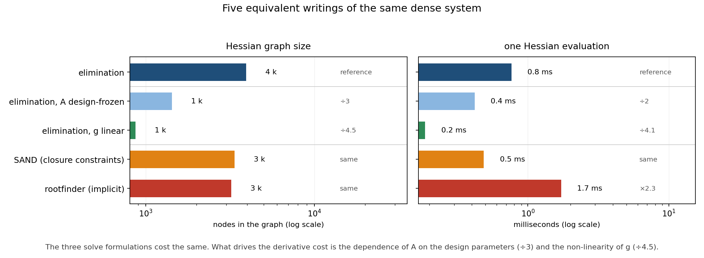
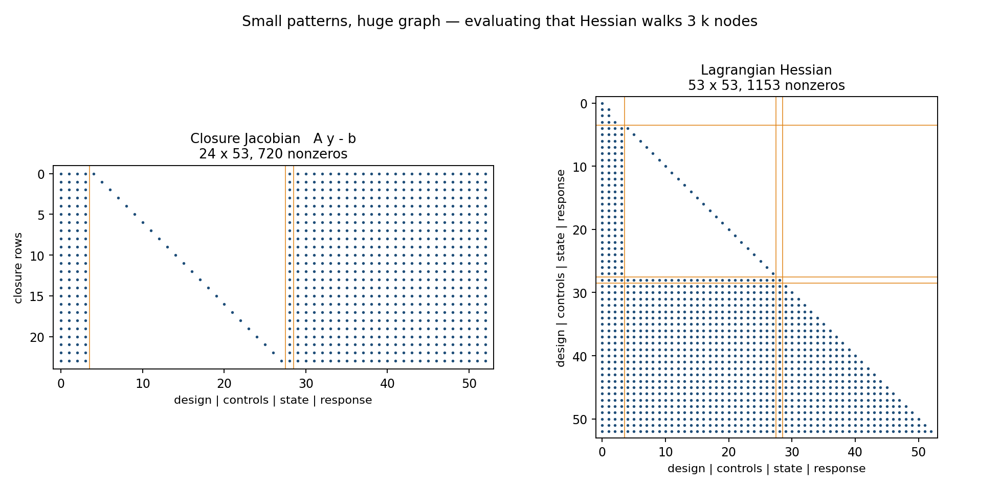

# A sparse Hessian can still be expensive

*A CasADi post about nested dense systems: where the derivative work really goes.*

## The situation

Many models hide a small dense linear system:

```
A(p, v) y = b(p, u, v)
```

`A` is dense because it comes from some interaction law — an influence matrix, a
kernel, an integral operator — and it depends on the design parameters `p`, on the
controls `u` and on the state `v`. The outputs are then some non-linear function
of the response `y`.

When such a model is embedded in a nonlinear program, CasADi has to build the
derivatives of the outputs with respect to everything. The first instinct is that
the linear solve must be the expensive part. It is not.

## Where this shows up

The pattern is always the same: a dense system whose entries depend on the
decision variables, followed by a non-linear reading of its solution.

- **Structural design.** A linear finite-element model `K(p) u = f`, with `p` the
  thicknesses or sections. Condense or substructure the model and `K` becomes
  dense; optimising the shape means differentiating `K(p)^-1 f`.
- **Circuit design.** Modified nodal analysis `G(p) v = i`, with `p` the component
  sizes, evaluated at several operating points.
- **Process engineering.** A thermodynamic equilibrium solved by Newton inside an
  energy balance. The gradient of the process model goes through the solver, not
  through the balance.
- **Gaussian-process models.** Fitting a kernel whose length scales are tuned by
  gradient: the gradient of the likelihood passes through a dense factorisation.
- **Boundary and panel methods.** A dense influence matrix built from a geometry
  that itself depends on shape parameters.
- **Robotics and control.** Kinematic or contact constraints solved at every step
  of a predictive controller.

In all of them the solve is cheap and the differentiation of the solve is not —
which is what the numbers below show.

## The example

`example.py` is a self-contained, 180-line version of that structure:

```python
coordinates = locator * (1.0 + 0.4 * design[1] * locator) * (0.5 + 0.2 * design[0])
weights = WEIGHT * design[2] * (1.0 - 0.4 * design[3] * locator)
K = cas.MX.zeros(N, N)
for i in range(N):
    for j in range(N):
        if i != j:
            K[i, j] = (coordinates[1] - coordinates[0]) / (
                4.0 * np.pi * (coordinates[i] - coordinates[j])
            )
A = cas.MX.eye(N) + cas.diag(OMEGA * weights / state) @ K
b = OMEGA * weights * (controls + 0.1 * locator)
```

The kernel is rational in the coordinates, so the matrix is dense and non-linear
in the design parameters. The response feeds an argument
`a = u + c (K y) / v`, and the outputs pass through a non-linearity
`g(a) = ω a − 5 a³`.

Five equivalent ways to write the same object are timed:

| writing | what changes |
|---|---|
| `elimination` | `y = A \ b`, the natural expression |
| `SAND` | `y` is a variable, `A y = b` is a constraint |
| `rootfinder` | `y = rootfinder(...)`, implicit differentiation |
| `elimination, A frozen` | ablation: `A` stops depending on `p` |
| `elimination, g linear` | ablation: `g(a) = ω a` |

## What the measurements say



| writing | Hessian graph | one Hessian evaluation |
|---|---:|---:|
| elimination | 231 k nodes | 13 ms |
| elimination, `A` frozen | 3 k nodes | 0.5 ms |
| elimination, `g` linear | 70 k nodes | 2.6 ms |
| SAND | 231 k nodes | 13 ms |
| rootfinder | 231 k nodes | 63 ms |

Three observations:

1. **The way you solve is not the problem.** Elimination, closure constraints and
   an implicit rootfinder all walk a graph of about 230 000 nodes. The rootfinder
   is even five times slower, because the implicit differentiation solves the
   system again on every evaluation.
2. **What the matrix depends on is the problem.** Declaring `A` independent of the
   design parameters divides the graph by 75 and the evaluation time by 46. That
   is where the work is.
3. **The non-linearity of the output costs too.** A linear `g` divides the graph
   by 3.3.

## The trap: reading the pattern



The assembled derivatives look harmless: the closure Jacobian has 720 nonzeros and
the Lagrangian Hessian 1 153 nonzeros. A solver sees small, well-structured
matrices. And yet evaluating that Hessian means walking a 231 000-node graph.

Nonzeros count what the solver stores. Nodes count what CasADi computes. For a
model that hides a dense non-linear system, the two numbers have nothing to do
with each other.

## What actually helps

Since the cost lives in the dependence of the matrix on the variables, the levers
are the ones that reduce that dependence or the amount of differentiation it
generates:

- **freeze what can be frozen** — a matrix that does not depend on the decision
  variables costs almost nothing to differentiate;
- **keep the intermediate quantities symbolic-friendly** — every square root,
  norm, interpolation or re-parametrisation on the path multiplies the graph;
- **expand on the fly, not symbolically** — if only a Hessian-vector product is
  needed, `jacobian`/`hessian` of a `Function` is rarely the cheapest formulation;
- **consider an approximate Hessian** when the exact one is dominated by a
  sub-model whose curvature contribution is small.

What does not help, on this structure: rewriting the solve. SAND and rootfinder
change the shape of the NLP, not the size of the differentiation graph.

## Reproduce

```bash
python example.py     # ~7 s: results.json + patterns.npz
python figures.py     # figures/cost.png + figures/patterns.png
```

Times are single-thread medians on a shared workstation and move by about 20 %
between runs; the graph sizes and the ranking do not.

## References

- Haftka, R. T., "Simultaneous Analysis and Design," *AIAA Journal*, Vol. 23,
  No. 7, 1985, pp. 1099–1103. [doi:10.2514/3.9043](https://doi.org/10.2514/3.9043)
