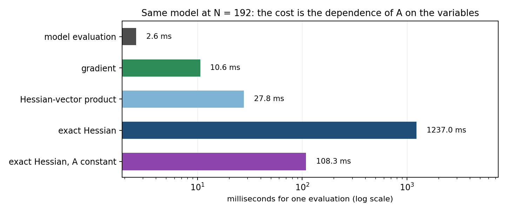

# When a dense solve becomes expensive to differentiate

Many models hide a small dense linear system:

```
A(x) y = b(x)
```

`A` is dense because it comes from some interaction law — an influence matrix, a
kernel, an integral operator — and it depends on some of the optimisation
variables: here the design parameters and the state. The outputs are then a
non-linear reading of the response `y`.

Evaluating all of that is cheap. Differentiating it twice is not, and the cost is
not where one usually looks for it.

## What it costs

`example.py` builds such a model at `N = 192`, with one twist: it also builds the
**same model with a constant coefficient matrix**. The right-hand side and the
outputs still depend on the variables, so the solve is still differentiated — only
the dependence of the coefficients on `x` disappears.



| quantity | graph nodes | one evaluation |
|---|---:|---:|
| gradient | 357 | 11 ms |
| `H·v` | 540 | 28 ms |
| exact Hessian | 58 073 | **1 280 ms** |
| exact Hessian, `A` constant | 54 387 | **108 ms** |

Three things to read from this:

1. **First order is not the problem.** The gradient costs 11 ms and the
   Hessian-vector product 28 ms: differentiating through an implicit solve is
   carried by a linear solve, not by an expanded graph.
2. **The full Hessian is.** 1 280 ms for a system of 192 unknowns — a hundred times
   the gradient.
3. **The dependence of the coefficients is what costs.** Removing it, without
   removing the solve, divides the Hessian cost by twelve — while the graph keeps
   almost the same size (54 387 against 58 073 nodes). For `A(x) y = b(x)`, a
   constant `A` keeps the `A^-1 b_x` part of the derivative and drops everything
   generated by `A_x` and `A_xx`. Those terms account for most of the additional
   cost here.

The practical reading: if you only need second-order information to guide a
solver, a directional product is forty times cheaper than the matrix. And if you
can make part of the matrix independent of the variables — a frozen geometry, a
precomputed table — do it before looking for a solver trick.

## A CasADi gotcha, in passing

The same dense kernel can be written as a matrix expression, or assembled element
by element in a Python loop. The numbers are identical to `1e-17`; the graphs are
not. At `N = 24`, the element-by-element version produces 5 538 nodes for the
kernel against 32, and 226 881 nodes for the Hessian against 3 947 — with an
evaluation time a factor of fifteen higher.

With `MX`, a matrix operation stays one node; a loop with scalar assignments
creates one node per entry. It costs nothing to write it the matrix way, and it is
worth checking before blaming the solver for your graph size. The check is in
`validation/check_equivalence.py`.

## Scope

This measures a model in isolation: derivatives of its outputs, not a solved NLP.
Nothing here says how these costs turn into IPOPT iterations, a KKT factorisation
or the wall time of a complete optimisation.

## Reproduce

```bash
python example.py                              # about a minute
cd validation
python check_equivalence.py                    # the two kernel writings agree
python writings.py                             # the same solve, five ways
python scaling.py                              # N = 12 to 192, with control objects
```

The script prints the table above and writes `hessian_cost.png`. Times vary by tens
of percent between runs on a shared machine; the graph sizes do not.
