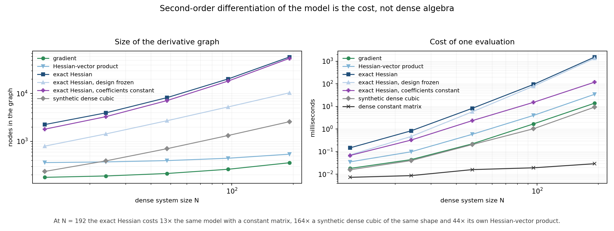

# Exact Hessians of nested dense systems can be expensive

*A CasADi post about dense models: what makes their derivatives costly, and what
only looks like it does.*

## The situation

Many models hide a small dense linear system:

```
A(p, v) y = b(p, u, v)
```

`A` is dense because it comes from some interaction law — an influence matrix, a
kernel, an integral operator — and it depends on the design parameters `p`, on the
controls `u` and on the state `v`. The outputs are then some non-linear function
of the response `y`.

Three things can make the derivatives of such a model expensive, and they are easy
to confuse:

1. **how the dense object is written** — a matrix expression or a scalar loop;
2. **how the inner solve is written** — elimination, closure constraints, implicit
   rootfinder;
3. **how much second-order differentiation the model really demands**.

This post separates them with measurements.

## The example

`example.py` builds the model:

```python
coordinates = (
    locator
    + 0.12 * design[0] * (1.0 - locator**2)
    + 0.08 * design[1] * locator * (1.0 - locator**2)
)
span = cas.reshape(coordinates, N, 1)
difference = cas.repmat(span, 1, N) - cas.repmat(span.T, N, 1) + cas.MX.eye(N)
kernel = ((coordinates[1] - coordinates[0]) / (4.0 * np.pi)) / difference
kernel = kernel - cas.diag(cas.diag(kernel))
```

The kernel is a rational function of coordinates that depend on the design
parameters, the response feeds an argument `a = u + c (K y) / v`, and the outputs
pass through a non-linearity `g(a) = ω a − 5 a³`.

## Lesson 1: a matrix expression is not a scalar loop

The same kernel can be assembled entry by entry:

```python
kernel = cas.MX.zeros(N, N)
for i in range(N):
    for j in range(N):
        if i != j:
            kernel[i, j] = (x[1] - x[0]) / (4.0 * np.pi * (x[i] - x[j]))
```

The numbers are identical to the matrix form (agreement to `1e-17`), the graphs
are not:

| at `N = 24` | scalar loop | matrix expression |
|---|---:|---:|
| nodes for the kernel | 5 538 | 32 |
| nodes for the Hessian | 226 881 | **3 947** |
| one Hessian evaluation | 11.9 ms | **0.8 ms** |

Measured by `check_equivalence.py`, which also verifies that the two writings
agree to `7e-15` on the Hessian, `4e-15` on the gradient and `1e-17` on the
kernel itself, over four design points; the script writes `equivalence.json`.

With `MX`, a matrix operation stays one node; a Python loop with scalar
assignments creates one node per entry. This is pure representation: fixing it
costs nothing and changes the picture by a factor of about 60. Everything below
uses the matrix expression.

## Lesson 2: the formulation of the solve is not the dominant lever


| writing | Hessian nonzeros | Hessian graph | one evaluation |
|---|---:|---:|---:|
| elimination | 435 | 3 947 | 0.76 ms |
| SAND (closure constraints) | 1 153 | 3 356 | 0.49 ms |
| rootfinder (implicit) | 435 | 3 212 | 1.72 ms |
| elimination, `A` design-frozen | 325 | 1 431 | 0.42 ms |
| elimination, `g` linear | 135 | 868 | 0.19 ms |

All five are the same problem. Elimination, closure constraints and the implicit
rootfinder land within a factor of three on graph size, and a factor of 3.5 on
evaluation time — the rootfinder is the slowest, because it re-solves the system
on every call. Real, but an order of magnitude below the effects in lesson 1 and
lesson 3.

## Lesson 3: what is left is second-order differentiation, not dense algebra



The obvious objection is that the Hessian is dense, so of course it gets
expensive: at `N = 192` it has 19 503 nonzeros, exactly the full triangle. To
separate "a dense object is expensive" from "differentiating this model is
expensive", the sweep adds three controls of the same dimension:

- a **dense constant matrix**, the floor cost of materialising that many numbers;
- a **synthetic dense cubic** `sum((C x)^3)` with `C` dense and constant — a
  genuinely dense, genuinely variable Hessian with no model structure in it;
- the **same model with a constant matrix** — the design still drives the
  right-hand side and the outputs, but no linear solve has to be differentiated.

| `N` | nonzeros | gradient | `H·v` | exact Hessian | design frozen | matrix constant | dense cubic | dense constant |
|---:|---:|---:|---:|---:|---:|---:|---:|---:|
| 12 | 153 | 0.018 ms | 0.035 ms | 0.15 ms | 0.07 ms | 0.07 ms | 0.02 ms | 0.007 ms |
| 24 | 435 | 0.044 ms | 0.098 ms | 0.83 ms | 0.47 ms | 0.32 ms | 0.04 ms | 0.009 ms |
| 48 | 1 431 | 0.22 ms | 0.58 ms | 8.2 ms | 5.8 ms | 2.4 ms | 0.20 ms | 0.016 ms |
| 96 | 5 151 | 1.7 ms | 4.0 ms | 94 ms | 78 ms | 15 ms | 1.0 ms | 0.019 ms |
| 192 | 19 503 | 14 ms | 34 ms | **1 529 ms** | 1 332 ms | **118 ms** | 9.3 ms | 0.029 ms |

Four readings:

1. **It is not the size of the object.** Materialising a dense matrix of the same
   shape costs 0.03 ms at `N = 192` — four to five orders of magnitude below the
   model.
2. **It is not dense algebra in general.** The synthetic cubic has a dense,
   variable Hessian of the same shape and costs 9.3 ms, 164 times less.
3. **It is the coefficient matrix, not the solve.** Freezing the design parameters
   inside the matrix buys only 13 % at `N = 192`. Making the matrix constant drops
   the same model from 1 529 ms to 118 ms, a factor of 13 — and the solve is still
   differentiated there: it is the dependence of the coefficients on the variables
   that disappears, not the solve.
4. **Materialising the full second-order object has its own price.** The
   Hessian-vector product is 44 times cheaper than the complete Hessian at the
   same size. If a solver only needs directional second-order information, the
   full matrix is not the thing to build.

The first two lessons said what the cost is *not*; the third control says where it
is. For a solve `A(x) y = b(x)`, a constant `A` keeps the `A^-1 b_x` part of the
derivative and removes everything coming from `A_x` and `A_xx`. Those terms are the
cost.

## Reading the pattern


The assembled derivatives stay small — 720 nonzeros for the closure Jacobian,
1 153 for the Lagrangian Hessian. A solver sees well-structured matrices; the
work of producing them is somewhere else. Nonzeros count what is stored, nodes
count what is computed.

## What actually helps

- **Write matrix expressions where matrix expressions exist.** The single largest
  win in this study, and it is free.
- **Freeze what is genuinely constant.** NumPy values, not symbolic loops, for
  anything that does not depend on the decision variables.
- **Ask whether you need the full Hessian.** Directional second-order information
  is an order of magnitude cheaper here.
- **Look at what the matrix depends on, not only at how big it is.** The solve was
  the whole cost here; freezing the design parameters, which looked like the
  obvious suspect, changed almost nothing.
- **Check before rewriting your solve.** On this structure, elimination, closure
  constraints and an implicit rootfinder are interchangeable in cost.

## Where this shows up

The pattern is always the same: a dense system whose entries depend on the
decision variables, followed by a non-linear reading of its solution.

- **Structural design.** A linear finite-element model `K(p) u = f`, with `p` the
  thicknesses or sections. Condense or substructure the model and `K` becomes
  dense; optimising the shape means differentiating `K(p)^-1 f`.
- **Circuit design.** Modified nodal analysis `G(p) v = i`, with `p` the component
  sizes, evaluated at several operating points.
- **Process engineering.** A thermodynamic equilibrium solved by Newton inside an
  energy balance. The gradient of the process model goes through the solver, not
  through the balance.
- **Gaussian-process models.** Fitting a kernel whose length scales are tuned by
  gradient: the gradient of the likelihood passes through a dense factorisation.
- **Boundary and panel methods.** A dense influence matrix built from a geometry
  that itself depends on shape parameters.
- **Robotics and control.** Kinematic or contact constraints solved at every step
  of a predictive controller.

## Scope

Everything above measures a model in isolation: derivatives of its outputs, not a
solved NLP. Nothing here says how these costs translate into IPOPT iterations, a
KKT factorisation, or the wall time of a complete optimisation. The claim is
narrower: for this structure, the derivative cost lives in the dependence of the
coefficient matrix on the variables — the terms generated by differentiating that
dependence — and not in the size of the dense object nor in the algebra of the
solve.

## Reproduce

```bash
python check_equivalence.py   # scalar loop against matrix expression, values and derivatives
python example.py             # five writings at N = 24 -> results.json, patterns.npz
python scaling.py             # N = 12 to 192, with controls -> scaling.json
python figures.py             # figures/cost.png, patterns.png, scaling.png
```

Times are single-thread medians on a shared workstation. They move by tens of
percent between runs, up to about 40 % on the slowest curve; the graph sizes and
the nonzeros do not. Compare a fresh run to `scaling.json` with that in mind.

## References

- Haftka, R. T., "Simultaneous Analysis and Design," *AIAA Journal*, Vol. 23,
  No. 7, 1985, pp. 1099–1103. [doi:10.2514/3.9043](https://doi.org/10.2514/3.9043)
- CasADi documentation, *The MX symbolics*:
  <https://web.casadi.org/docs/#the-mx-symbolics>
