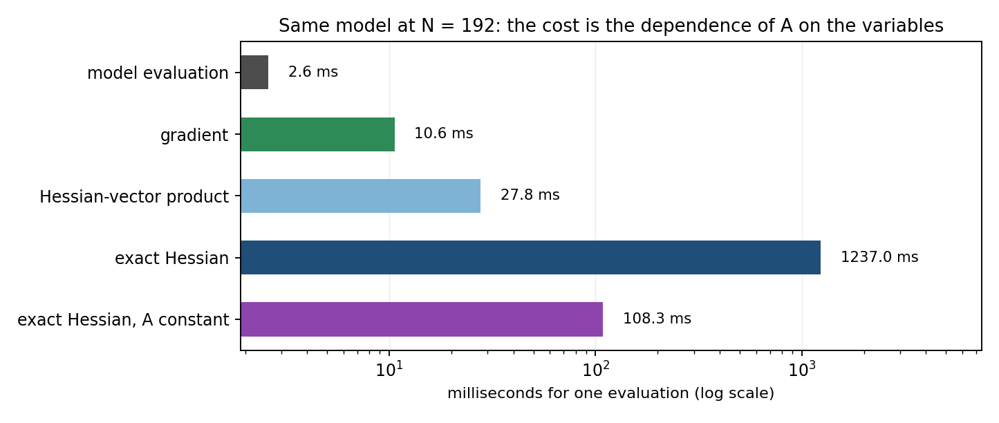

# A cheap dense solve can be expensive to differentiate

The model is a dense linear system followed by a nonlinear output:

```text
A(x)y = b(x)
outputs = f(y, x)
```

Here the coefficients depend on design and state variables. `example.py`
compares exact derivatives at N=192 with an ablation that freezes only the
coefficient matrix A at the nominal point. The right-hand side and output
still depend on the variables.

## Evaluation cost



| Quantity | Graph nodes | One evaluation |
|---|---:|---:|
| Model evaluation | 82 | 2.6 ms |
| Gradient | 357 | 11 ms |
| Hessian-vector product | 540 | 28 ms |
| Exact Hessian | 58,073 | 1,237 ms |
| Exact Hessian, A constant | 54,387 | 108 ms |

These are the original single-machine measurements. A full Hessian costs much
more than a directional product in this example. Freezing A reduces its cost
by about eleven while leaving a similar graph-node count.

For `A(x)y=b(x)`, differentiating the solve includes the coefficient terms
`A_x` and `A_xx`. A constant A removes those terms but retains differentiation
of the right-hand side. The ablation illustrates their cost; it is not an
equivalent model or a recommendation to freeze coefficients during design
optimisation. Graph nodes also differ in their numerical work, so their count
alone is not an operation count.

This measures derivative evaluation, not an NLP solve, IPOPT iteration count
or KKT factorisation. The Hessian is of the summed outputs; the published
Hessian entries are its lower triangle. A Hessian-vector product gives
second-order directional information, not the full matrix.

## Reproduce

From `01-derivative-cost/` with Python 3.11+, CasADi 3.7+, NumPy and Matplotlib:

```bash
export OMP_NUM_THREADS=1 OPENBLAS_NUM_THREADS=1 MKL_NUM_THREADS=1
export NUMEXPR_NUM_THREADS=1 PYTHONHASHSEED=0 MPLBACKEND=Agg
ulimit -v 2097152
ulimit -s 65536
ulimit -c 0
nice -n 10 timeout 300s python example.py
```

The script prints a new timing table and writes `hessian_cost.png` in the
current directory. It remains a flat study script, not an importable library.
Times vary by machine and load; the displayed table is not regenerated by
this README.

The [validation scripts](validation/README.md) compare the kernel assembly and
derivatives, study several formulations/ablations and sweep system size.
Run them in a copied directory if the published artifacts must be preserved.
