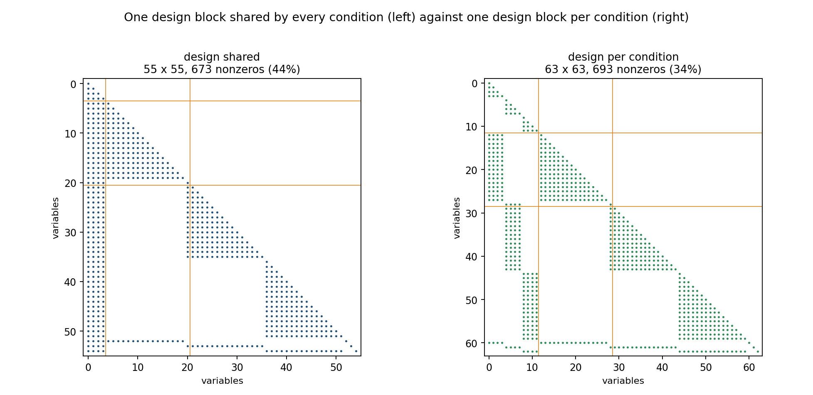
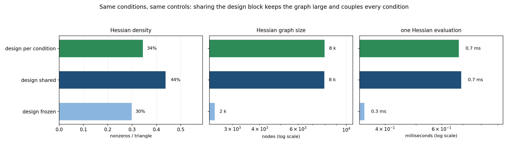

# Sharing one design block across every condition

*A CasADi post about the structure that appears when design parameters and
trajectory variables live in the same nonlinear program.*

## The situation

A multidisciplinary optimisation problem usually looks like this:

- a handful of **design parameters** that describe the system;
- a number of **conditions** — operating points, time steps, load cases — each
  with its own **controls** and its own **state**;
- one model per condition whose matrix is dense and depends on both the shared
  design and the local variables.

Writing all of it as a single NLP is the natural thing to do: the optimiser
explores the design space and the trajectory at the same time. It also changes the
shape of the derivatives in a way that is easy to miss.

## Where this shows up

This is the standard shape of multidisciplinary optimisation: one set of design
variables, many conditions, and a model that couples them.

- **Aerospace sizing.** Structural thicknesses shared by several load cases, each
  with its own aeroelastic state. The all-at-once (SAND) architecture keeps
  everything in one problem; the multidisciplinary-feasible (MDF) architecture
  solves each discipline in an inner loop instead.
- **Power systems.** Equipment ratings (design) with hourly dispatch profiles
  (controls) for a whole year of representative days.
- **Robot co-design.** Link lengths and actuator sizes optimised together with
  the trajectories the robot will execute.
- **Circuit design.** Component sizes tuned across several operating points —
  temperature, supply voltage, load — so the design block is shared by every
  corner.
- **Process design.** Reactor volume and feed temperatures chosen jointly with
  the operating profile over a batch.
- **Building energy.** Equipment sizing plus usage schedules, where the schedule
  is the controller's decision on top of a fixed design.

The naming is old and stable: optimising analysis variables and design variables
as one problem is *simultaneous analysis and design* (SAND), the alternative being
to solve the analysis inside an outer design loop. The first keeps the coupling in
the KKT matrix; the second keeps the blocks separate but pays for many more
design iterations. Both are correct — the point of this post is only to make the
structural cost of the first one visible.

## The example

`example.py` reuses the same model as the first post — a dense matrix
built from coordinates that depend on the design parameters, a response, and a
non-linear output — and repeats it over `K` conditions:

```python
for k in range(K):
    matrix = cas.MX.eye(N) + cas.diag(OMEGA * weights / state[k]) @ kernel
    rhs = OMEGA * weights * (controls[:, k] + 0.1 * locator)
    response = cas.solve(matrix, rhs)
    argument = controls[:, k] + COUPLING * (kernel @ response) / state[k]
    objectives.append(cas.sum1((OMEGA * argument - 5.0 * argument**3) * weights))
```

Three writings of the same problem are compared:

| writing | design parameters |
|---|---|
| `design shared` | one block, used by every condition |
| `design per condition` | one independent block per condition |
| `design frozen` | constants |

The first two have identical local models and therefore identical differentiation
work per condition. The only difference is the sharing.

## What the measurements say





| writing | variables | Hessian nonzeros | density | Hessian graph | one evaluation |
|---|---:|---:|---:|---:|---:|
| design shared | 55 | 673 | 44 % | 235 k nodes | 12.2 ms |
| design per condition | 63 | 693 | 34 % | 235 k nodes | 11.9 ms |
| design frozen | 55 | 459 | 30 % | 4 k nodes | 0.4 ms |

Three observations:

1. **Sharing couples everything.** With one shared block, the design columns run
   through the whole Hessian: every condition is connected to every other one
   through the design. With one block per condition, the Hessian keeps its block
   structure. Same number of nonzeros, very different connectivity — and that
   connectivity is what a sparse factorisation pays for.
2. **Coupling does not make the graph bigger.** The shared and per-condition
   writings walk the same 235 000-node graph, because the local model is the same.
   What costs is that the model depends on the design at all.
3. **Freezing the design is what makes a difference** — 4 000 nodes instead of
   235 000. It also gives up the thing you wanted: optimising the design.

## What to take away

Putting the design in the same NLP as the trajectory is a trade, not a free
win:

- you gain a single joint problem, solved once, with the coupling handled by the
  KKT system;
- you pay a denser Lagrangian Hessian (here 44 % against 34 %) and a graph that
  stays large as long as the model depends on the design.

Two practical consequences for a CasADi model:

- if the design parameters are few and shared, expect dense columns in the
  Hessian; ordering the variables so that the design block comes first (or last)
  keeps the factorisation as close to block-arrow as possible;
- if a part of the model can be evaluated without the design — a precomputed
  table, a frozen influence matrix — moving it out of the differentiation path is
  worth far more than any solver-level trick.

## Reproduce

```bash
python example.py     # a few seconds: results.json + patterns.npz
python figures.py     # figures/hessian_patterns.png + figures/cost.png
```

Times are single-thread medians on a shared workstation and move by about 20 %
between runs; the graph sizes and the ranking do not.

## References

- Haftka, R. T., "Simultaneous Analysis and Design," *AIAA Journal*, Vol. 23,
  No. 7, 1985, pp. 1099–1103. [doi:10.2514/3.9043](https://doi.org/10.2514/3.9043)
- Martins, J. R. R. A., and Lambe, A. B., "Multidisciplinary Design Optimization:
  A Survey of Architectures," *AIAA Journal*, Vol. 51, No. 9, 2013, pp. 2049–2075.
  [doi:10.2514/1.J051895](https://doi.org/10.2514/1.J051895)
