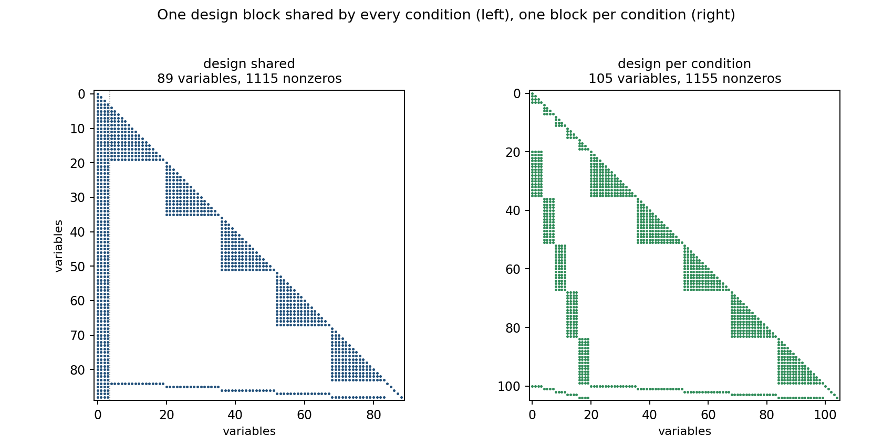

# Sharing a few design parameters across many conditions makes a star

A familiar shape in multidisciplinary optimisation: one small set of design
parameters, many conditions, and one dense model per condition.

```
design parameters p        shared by every condition
controls u_k, state v_k    one block per condition
A(p, v_k) y_k = b(p, u_k, v_k)
```

Writing all of it as a single NLP is the natural thing to do — the optimiser then
explores the design space and the trajectories at the same time. It also changes
the shape of the derivatives, in a way that is easy to miss.

## The structure

`example.py` builds the same problem twice, with `K = 5` conditions and a dense
system of size `N = 16` each. The local models are identical; the only difference
is whether the design block is shared or repeated per condition.



| layout | variables | Hessian nonzeros | density | Hessian graph |
|---|---:|---:|---:|---:|
| design shared | 89 | 1 115 | 28 % | 13 058 nodes |
| design per condition | 105 | 1 155 | 21 % | 13 112 nodes |

Sharing removes sixteen variables, leaves the nonzero count almost unchanged, and
runs its four design columns through every condition. On the left of the figure
those columns cross the whole matrix; on the right each condition keeps its own
block and the matrix stays block-structured.

## What it means

- **The coupling is structural, not numerical.** Both layouts cost the same to
  differentiate. What changes is the connectivity: every condition is connected to
  every other one through the shared block.
- **Connectivity is what will matter to a sparse factorisation.** A pattern with
  four wide columns does not factor like a block-diagonal one, even at equal
  nonzero count. This script does not measure that factorisation — it shows the
  structure that feeds it.
- **Order the variables deliberately.** With the design block first or last, the
  pattern stays as close to block-arrow as it can be.

If the design parameters were constants instead, each condition would stand alone
and the Hessian would be block-diagonal — that is the trade of joint optimisation,
and it is the same trade the companion post measures from the model side.

## Scope

The script builds the Hessian structure; it does not solve an NLP, and it does not
time a factorisation. What it shows is what the sharing does to the sparsity of the
derivatives — and that part is not an approximation.

## Reproduce

```bash
python example.py     # a few seconds
```

It prints the table above and writes `hessian_structure.png`.

```bash
python example.py
cd validation && python figures.py   # the three layouts measured, including a frozen design
```
