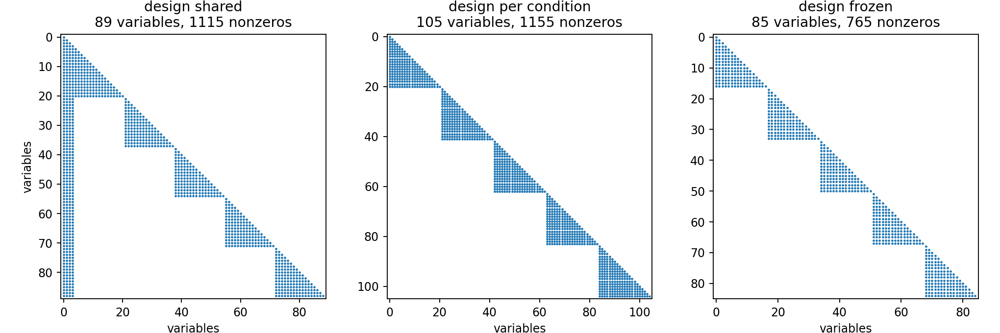

# Shared design creates a common Hessian border

A small design block can be shared by many conditions. Each condition keeps
its own controls, state and dense local solve:

```text
p                         design
u_k, v_k                  controls and state of condition k
A(p, v_k)y_k = b(p, u_k, v_k)
```

`example.py` compares shared, independent and frozen design at N=16 and K=5.
The local equations are identical. The dependency layouts and feasible design
spaces differ; this is a structural comparison, not three equivalent NLPs.

## The structure



| Layout | Variables | Hessian nonzeros | Triangle density | Hessian graph nodes |
|---|---:|---:|---:|---:|
| Shared design | 89 | 1,115 | 28% | 12,672 |
| Design per condition | 105 | 1,155 | 21% | 12,726 |
| Frozen design | 85 | 765 | 21% | 3,621 |

Counts refer to the lower triangle of the exact Lagrangian Hessian. Independent
and frozen layouts use contiguous condition blocks. Shared design has four
leading variables connected to every condition; the condition-to-condition
Hessian blocks remain zero. Graph connectivity through the common border does
not make those blocks dense.

Sharing removes sixteen variables relative to independent design and leaves
the nonzero count almost unchanged. Freezing removes all four design variables
and all their derivative terms. The frozen case has no inactive placeholder
variables.

## What is measured

The figure and counts describe derivative structure. The archived records also
contain warmed Hessian evaluation times at a common primal point and closure
multipliers equal to one. No NLP is solved and no KKT factorisation is timed.
The sparsity difference alone does not establish a whole-solve penalty.

[Validation records](validation/README.md) include the generator hash, points,
multipliers, timing samples and sparsity arrays. Earlier K=3 records are kept
separately as historical data; they are not the table above.

## Reproduce

From `02-design-control-coupling/` with Python 3.11 or later:

```bash
python -m pip install -r requirements.txt
export OMP_NUM_THREADS=1 OPENBLAS_NUM_THREADS=1 MKL_NUM_THREADS=1
export NUMEXPR_NUM_THREADS=1 PYTHONHASHSEED=0 MPLBACKEND=Agg
ulimit -v 2097152
ulimit -s 65536
ulimit -c 0
nice -n 10 timeout 180s python example.py --output runs/reproduction_NEW
python -m pytest -x -q
python validation/figures.py
```

Use a fresh output directory. `example.py` exports all three layouts to it;
`validation/figures.py` redraws the published figures from the archived data.
Importing `example` does not build models, measure times or write files.
