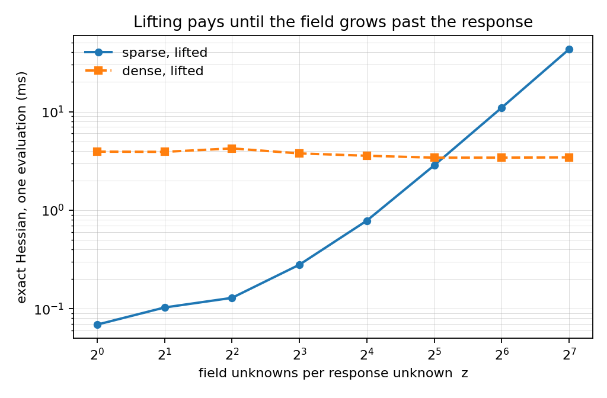

# Field ratio — where lifting pays

**Question.** The sparse operator wins up to 500x on the example it was designed
for (study 03). Does it still win on a real lifting-line rig, where the local
operator of a `1/r` kernel lives in a volume rather than on the response?

**Answer.** It stops winning at about **30 field unknowns per response unknown**.
The example carries 1. A 3-D rig of 42 panels asks for ~1,300. The same study
measures what a compiled tensor backend is worth on the same chain: one to two
orders of magnitude on the exact Hessian.

## The homotopy

The model is Joris's, unchanged: design `p`, state `v`, controls `u`, response
`y`, a dense influence kernel `K(p)`, and a nonlinear nodewise reading. What
changes is the field. The kernel is the Green function of a chain of `z*N`
nodes, compressed onto the `N` response nodes:

```text
K(p) = R L(p)^-1 S,   L tridiagonal,   z = field unknowns per response unknown
```

The compression is exact: at every `z` the dense and the sparse writings are the
same model (measured error ≤ 8e-13). At `z = 1` the model is Joris's exactly.
Four writings are timed per `z`: the kernel dense or sparse, the response
eliminated or lifted into the NLP.



| z | 1 | 2 | 4 | 8 | 16 | 32 | 64 | 128 |
|---|---|---|---|---|---|---|---|---|
| sparse, lifted (ms) | 0.069 | 0.103 | 0.129 | 0.280 | 0.784 | 2.859 | 10.994 | 43.105 |
| dense, lifted (ms) | 3.932 | 3.911 | 4.240 | 3.772 | 3.571 | 3.415 | 3.417 | 3.438 |
| winner | 57x | 38x | 33x | 13x | 4.6x | **1.2x** | dense 3.2x | dense 12.5x |

The dense writing costs what the response costs; the sparse writing costs what
the field costs. Both are flat in `z` on their own side, so the crossover is a
property of the ratio, not of the implementation. The eliminated sparse writing
degrades faster still: 0.9 ms at `z=1`, 2,084 ms at `z=128`, because the field
solve sits inside the graph.

All four writings reach the same optimum, −921.7978, for z ≤ 32.

## Large fields also degrade convergence

| z | iterations (sparse, lifted) | objective |
|---|---|---|
| 1 … 32 | 15 … 36 | −921.80, all four writings agree |
| 64 | 56 | −834.37, another stationary point |
| 128 | 86 | −651.52, another stationary point |

The model is non-convex. On a large field the lifted writing converges
elsewhere; the field grows not only the cost but the search.

## The same chain, CasADi versus JAX

The second question is whether a compiled tensor backend helps when the kernel
stays dense. The test is one chain written twice in CasADi and in JAX, on the
same seeded synthetic rig: geometry, Biot-Savart influence matrix, one dense
solve, a 250-centre RBF section polar, force and moment recovery. Parity of the
wrench, the Jacobian and the Hessian is gated at 1e-9 **before** any timing is
reported. Measured parity: 0.0 on all three.

| 42 panels, 9 shape controls | CasADi | JAX | speedup |
|---|---:|---:|---:|
| forward | 0.223 ms | 0.0166 ms | 13x |
| Jacobian | 0.662 ms | 0.0136 ms | 49x |
| **Hessian** | **1.258 ms** | **0.0179 ms** | **70x** |

Timings drift on a shared machine: the Hessian speedup was measured between 57x
and 111x across runs, at the same parity. The structure of the result is stable.

Where the gain comes from, measured on the same chain:

| diagnostic | value |
|---|---:|
| CasADi, trivial node (µs/node) | 0.0125 |
| CasADi, this chain (µs/node) | 0.305 |
| same CasADi graph, compiled to C | 1.1x |

The chain runs at 24x the cost of a trivial node, so the cost is arithmetic,
not graph interpretation: square roots and divisions of Biot-Savart, evaluated
scalar by scalar. Compiling the same CasADi graph to C recovers only 1.1–1.5x.
XLA wins by fusing and vectorising the tensor work. Generic AD, `jax.hessian`
over the whole variable vector, is the wrong tool regardless: it emits a full
N×N Hessian where the model has arrow structure, and runs out of memory at
T = 32 (`jax_dense_bench.py`, group J of the campaign).

## What this says

- Lifting pays while the field is about as large as the response. It stops near
  z = 30, and is an order of magnitude behind at z = 128.
- Cost is not the only thing the field grows: convergence moves too.
- A dense kernel does not make a compiled backend pointless. The same chain is
  70x cheaper to differentiate in JAX (57x to 111x across runs), because the
  cost is dense tensor work.

## What this does not say

- The chain is the generic shape of a sail-aero model, not a validated
  physical model. The rig is synthetic and seeded; the numbers are about
  evaluation cost, not about aerodynamics.
- The control dependence is a simplification on both sides, identical in both
  frameworks: twist and trim rotate normals and shift vortex ends. A real
  geometry chain (section reconstruction) is not covered.
- The homotopy model is Joris's toy model with a larger field. It shows the
  mechanism of the crossover; it does not model a real rig.

## Reproduce

```bash
python plot_results.py                           # figure from validation/results.json
python run_field_ratio.py --output runs/<fresh>  # homotopy campaign
XLA_FLAGS="--xla_cpu_multi_thread_eigen=false intra_op_parallelism_threads=1" \
  taskset -c 0 nice -n 10 python jax_same_chain.py --mechanism
```

Everything runs in the same envelope: 2 GiB address space, one thread, nice 10,
PYTHONHASHSEED=0. The campaign runs one process per cell and stops at the first
failure; published numbers live in `validation/`, new runs in `runs/`.
